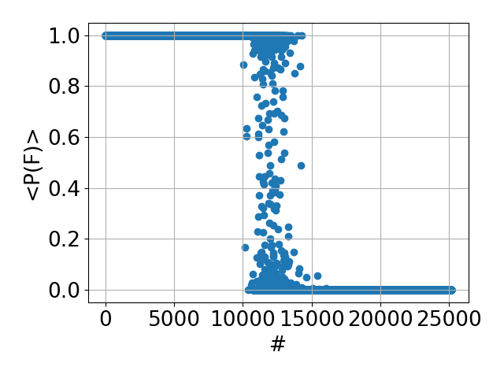

A repo to reproduce [Explaining the Machine Learning Solution of the Ising Model](https://arxiv.org/abs/2402.11701)
by Alamino from 2024.

We explore the author's suggestions.

- simulation employs [Wolff cluster updates](https://en.wikipedia.org/wiki/Wolff_algorithm) (lazy variant) -- just call `python generate_configs.py` 
- the simulation generates the right number of configs; it however is not aware of the sign such that the SLNN is
  trained on less configs than it should -- the work however still reproduces favorably (lazy variant) 
- PCA has a shortcoming here (secondary literature suggests nice separability for different projections on eigenvectors
  of M -- here, the particle number is not conserved so this is a little less visible)
- elegant idea of using a "SLNN" (a single layer NN) to predict the model's phase -- the SLNN is a simple logistic
  regression and it works nicely on data which has positive magnetization!
- SLNN args to activation function scale differently in this implementation -- might be due to other parameter samplers
  (maybe inherent in Pytorch as original work uses keras)
- the straightforward idea to extend the ML model by a 2-unit hidden layer can immediately predict the nice properties
  of the Ising model
- the graph on "inferred probabilities" is, at times, not reproducible -- we strongly depend on the seed;
  see below
- overall a very illuminating paper giving us _some_ intuition on what's actually going on for simple NN architectures
  _and_ we have some theory on the data-generating process  
- more implementation shortcomings: initialization for the Ising model and the paper's suggestions varies; "1HLNN" has
  no strictly correct way of initializing (needs work on that front to be fully explainable) 


Suggested way to run this repo:

```bash
micromamba env create -n repro-ising-ml 
micromamba activate repro-ising-ml
micromamba install -c conda-forge numpy tqdm pytorch scikit-learn matplotlib
# e.g.
python generate_configs.py
python apply_model.py 20 500 100 20 mlnn

# args are: L num_configs num_T num_epochs model
# L           -- 2d Ising model PBC grid with size L * L (fixed in `generate_configs.py` -- change at will
# num_configs -- number of configurations to generate per temperature 
# num_T       -- number of temperatures to generate samples for in [0.05, 5]
# num_epochs  -- number of training epochs 
# model       -- either "slnn" or "mlnn"
```

`apply_model.py` runs a training loop for `num_epochs` on data in the following way:
1. SLNN: here we only take configurations into account that have positive magnetization (see paper for reasoning
   on separating hyperplane)
2. MLNN: takes all configurations into account

For both cases we sample from data equidistant from `T_c`, ie. we only train on data in the union of the intervals
[0.05, 1.] and [4., 5.].


#### Comparing a little
The "explanatory" part for the network with a hidden layer is fuzzy. Results are not consistent. Trained on the
same data, same procedure, only the Pytorch-given seed differs -- the results are sometimes overwhelmingly different.


Compare

<table>
  <tr>
    <td></td>
    <td></td>
  </tr>
</table>

to

<table>
  <tr>
    <td></td>
    <td></td>
  </tr>
</table>

The test data here is now all of the data points that have been excluded from training, ie. all configs generated
for temperatures between 1 and 4.
